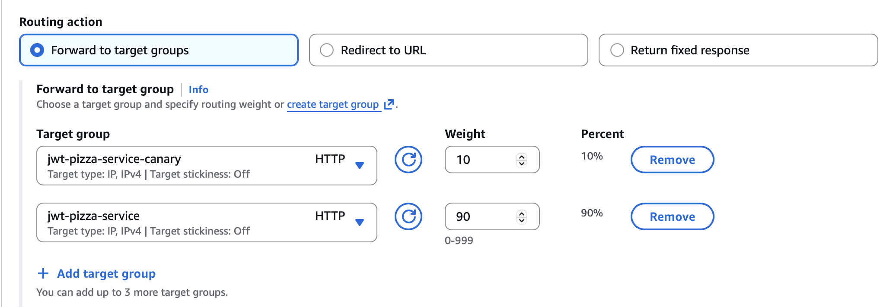
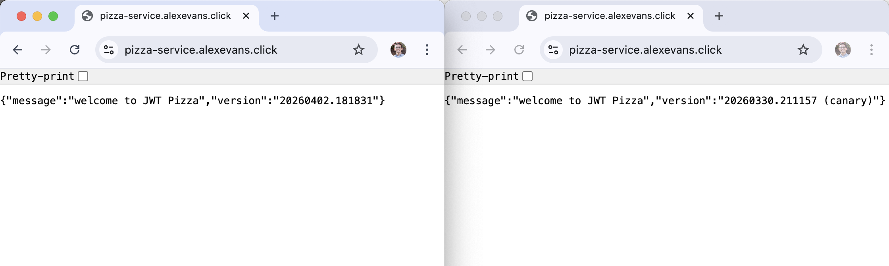

# Curiosity Report: **Canary Releases**

When I was visiting Google on a CS Tech Trek this semester, a full-stack developer mentioned using **canary releasing** to test out and roll out new features. As a person with interest in user experience design and testing, investigating this sounded interesting to me.

## Intro


The phrase "canary release" comes from the phrase *canary in a coal mine*. In coal mines in the early 1900s, miners used **canaries** to detect carbon monoxide and other toxic gases. The gasses would affect canaries faster than humans, acting as a warning system for the miners.

In the context of **software development**, using **canary releases** allow for developers to have features incrementally tested by a small set of users before having it rolled out on the whole service.

> **Image and Text Sources:** [Domestic canary (Wikipedia)](https://en.wikipedia.org/wiki/Domestic_canary#Miner's_canary), [Feature toggle (Wikipedia)](https://en.wikipedia.org/wiki/Feature_toggle#Canary_release)

## Canary Releases with JWT Pizza

### High-Level Overview

In order to implement canary releases with JWT pizza, I created a new deployment Docker container, uploaded it to AWS Elastic Container Registry tagged as `canary`, created new services and rules for the new container, and finally edited the load balancer to distribute incoming traffic.

### Steps

Here are the specific steps I followed to create a canary release:

1. Create a new CI pipeline to upload a Canary container to AWS Elastic Container Registry.
	- I did not change my service code at all, besides adding `(canary)` after the version number to distinguish my two deployments later on.
	- I also changed the `docker` command to add a `:canary` tag to the container we are uploading to ECR, so it is distinguished from our normal service. In a normal production workflow, I am guessing you would not do this, and instead tag it as `latest` like usual.
	
```yml
  - name: set version
	id: set_version
	run: |
	  version=$(date +'%Y%m%d.%H%M%S')
	  echo "version=$version" >> "$GITHUB_OUTPUT"
	  printf '{"version": "%s" }' "$version (canary)" > src/version.json
	  
...

- name: Build and push container image
  id: build-image
  env:
	ECR_REGISTRY: ${{ steps.login-ecr.outputs.registry }}
	ECR_REPOSITORY: 'jwt-pizza-service'
  run: |
	docker build --platform=linux/arm64 -t $ECR_REGISTRY/$ECR_REPOSITORY:canary --push .
	echo "image=$ECR_REGISTRY/$ECR_REPOSITORY:canary" >>  $GITHUB_OUTPUT
```

2. Verify the new container tagged with `canary` is uploaded to your AWS ECR `jwt-pizza-service` repository.
3. Follow class instruction ([AWS RDS MySQL](https://github.com/devops329/devops/blob/main/instruction/awsRdsMysql/awsRdsMysql.md), [Elastic Container Services (ECS)](https://github.com/devops329/devops/blob/main/instruction/awsEcs/awsEcs.md)) to create a new VPC security group, ECS task definition, ECS cluster, and ECS service for your canary deployment.
	- While following along, instead of writing `jwt-pizza-service` for many names, I wrote `jwt-pizza-service-canary`.
	- While creating the ECS service, link it to your existing load balancer; we will edit the rules later.
4. Open EC2, navigate to **Target Groups**, open `jwt-pizza-service-canary`, and verify it is healthy.
5. Navigate to **Load Balancers**, open `jwt-pizza-service`. Open up the **`HTTPS:443`** rule at the bottom. A rule should have just been created; delete it so there's only the one rule remaining before that forwards to the `jwt-pizza-service` target group.
6. Press the edit icon on the remaining listener rule. Under **Forward to target group**, this is where you can add another target group and adjust the weights.
	- You can adjust it. For a regular release, 10% weight on canary should be good. You can increase it as you gain confidence it is working.

7. Click **Save changes**. Now, as users make calls to your backend, on average 10% of the requests will be routed to the new system.


## Importance to QA/DevOps

This is important to Quality Assurance, because you want to make sure that new versions of your applications work as they are supposed to.

When 10% of your traffic is going to a new place, you can check your metrics and logs to ensure everything is working as it is supposed to. If things aren't, then you remove the separation of traffic, fix, and repeat this process.

This could also be a good way to test new features, both frontend and backend. Thinking more broadly than this AWS infrastructure, one could set up systems that automatically distribute 10-25% of users to a new system. Then, a feedback system could be in place to get reviews of your new features.

## Conclusion

It was fun to get my hands dirty by working directly in AWS, instead of only reading up on a topic. I ran into a few problems along the way, but coming out I understand the infrastructure we learned in class better. I think it's cool that I was able to make it work!
