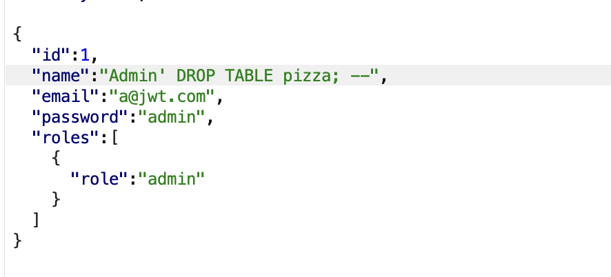
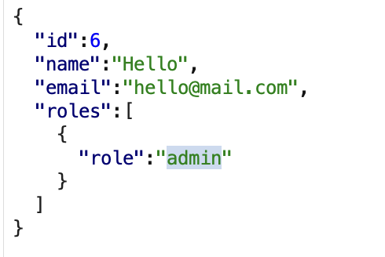
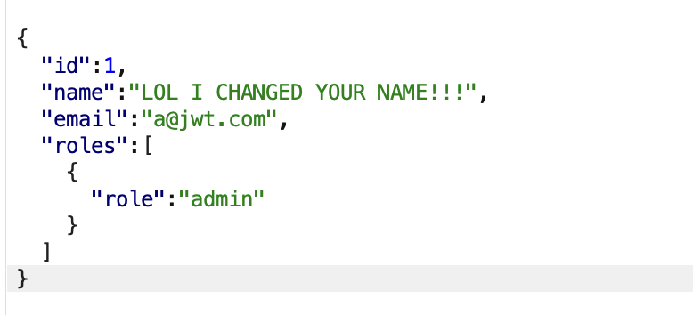
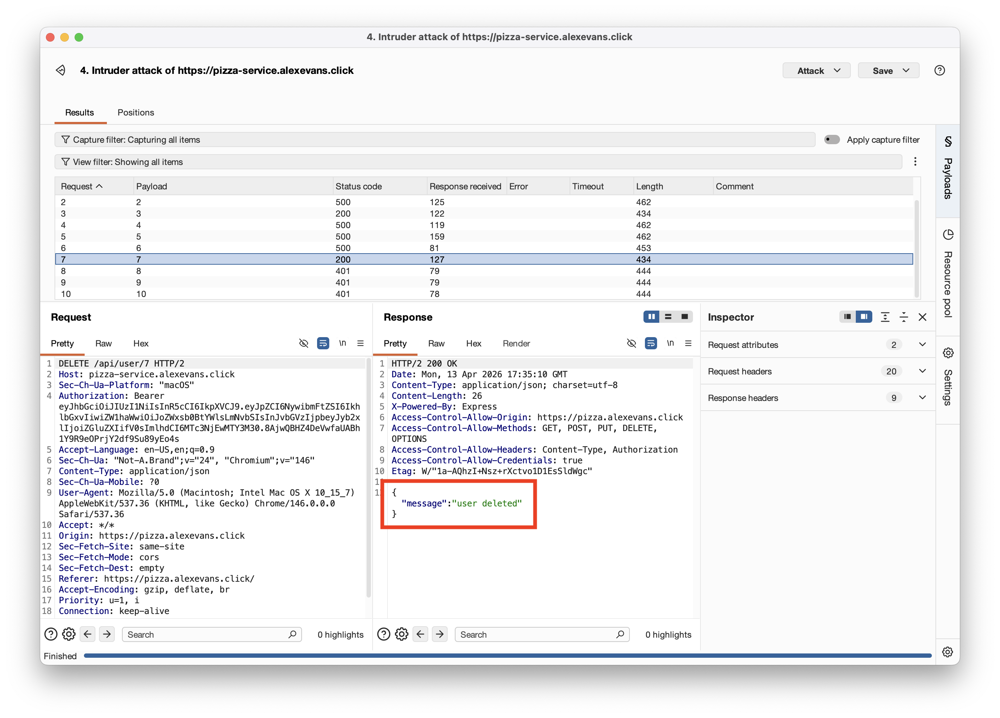
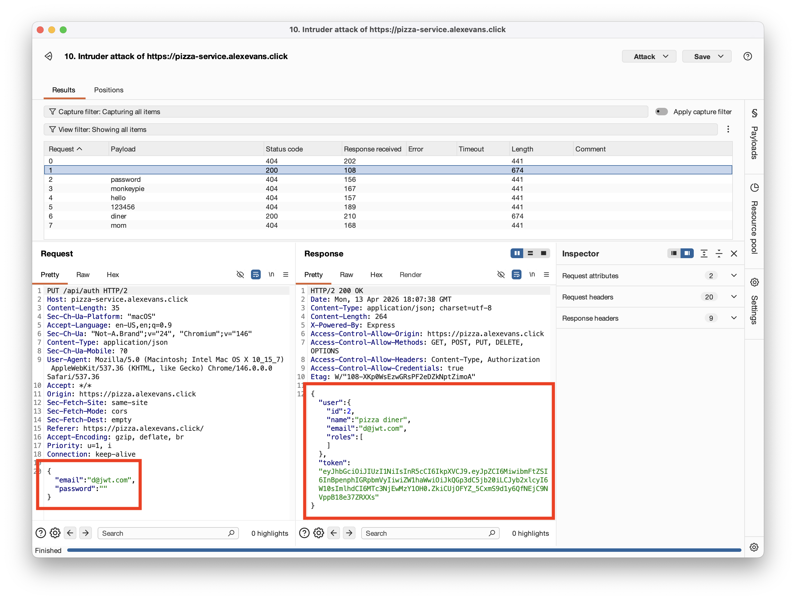
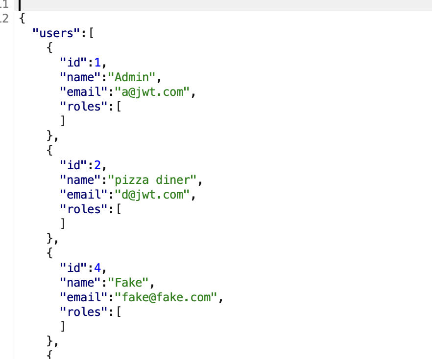

# Self attack

## Plan

- Login as admin user and delete everything
- Password
- SQL Injection?
    - **NOPE**. number 1
- DDOS. Need rate limiting?
    - Too hard man
- Brute force passwords
    - Number 5, yep.
- Pizza ordering
- Mess with my log data?
- Mess with DB calls so some fields are missing queries
- jwtSecret thing?
    - Do something with the response JWT
- A way to get all order data, or user data
    - 

## Discoveries

- Can you change the role of a user when you send it to the backend?
    - No. number 2
    - Tried changing the name of a user by changing the request.
- Any user can delete any other user.
    - Number 3.
    - Yep! Used intruder to spam delete all
- Anyone can get the list of users
    - Yep

Going forward: I need to look through my code again to see what should be fixed.

## Self Attacks

| Item | Result |
| ---- | ------ |
| Date | April 9, 2026 |
| Target | pizza.alexevans.click |
| Classification | Injection |
| Severity | 0 |
| Description | SQL injection through updating a user, to try and delete the database. Failed.|
| Images | 
| Corrections | Still, would be good to go and sanitize my user inputs. |

| Item           | Result                                                                                                                                             |     |
| -------------- | -------------------------------------------------------------------------------------------------------------------------------------------------- | --- |
| Date           | April 9, 2026                                                                                                                                      |     |
| Target         | pizza.alexevans.click                                                                                                                              |     |
| Classification | Broken Access Control                                                                                                                              |     |
| Severity       | 0                                                                                                                                                  |     |
| Description    | Attempted to change the name of a different user or role of self when you send it to the backend via the `PUT /api/user/:userId` endpoint. Failed. |     |
| Images         |            |     |
| Corrections    | None needed. Endpoint already verifies authorization                                                                                               |     |

| Item           | Result                                                                                       |
| -------------- | -------------------------------------------------------------------------------------------- |
| Date           | April 13, 2026                                                                               |
| Target         | pizza.alexevans.click                                                                        |
| Classification | Broken Access Control                                                                        |
| Severity       | 1                                                                                            |
| Description    | Any other user can successfully delete another user via the `DELETE /api/user/:id` endpoint. |
| Images         |                                 |
| Corrections    | Add authorization check for deletion of users.                                               |

| Item           | Result                                                                               |
| -------------- | ------------------------------------------------------------------------------------ |
| Date           | April 13, 2026                                                                       |
| Target         | pizza.alexevans.click                                                                |
| Classification | Identification and Authentication Failures                                           |
| Severity       | 2                                                                                    |
| Description    | Brute force of passwords to log into a user account. Succeeded with a blank password |
| Images         |                  |
| Corrections    | Prevent login with no password in the payload.                                       |

| Item           | Result                                                                           |
| -------------- | -------------------------------------------------------------------------------- |
| Date           | April 13, 2026                                                                   |
| Target         | pizza.alexevans.click                                                            |
| Classification | Broken Access Control                                                            |
| Severity       | 2                                                                                |
| Description    | Access the list of all users without admin authentication. Successful!           |
| Images         |  |
| Corrections    | Require admin authorization for viewing list of users.                           |
